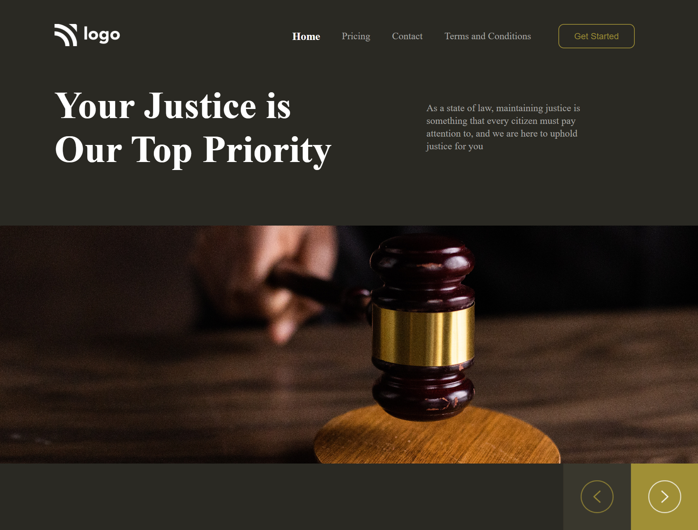

# UI Project 03 - Digital Marketing Website

> ### **Deployed Website** :-[Live Link](https://ui-project-3.netlify.app/)
 

## Project key takeaways:

  - Used Only **Html** and **CSS**
  - I learned to set up background images to the required position.
  - I learned to create menubar using the grid.

   

 

> ## It took around 2 hours to complete and make this project **Mobile** Responsive.
